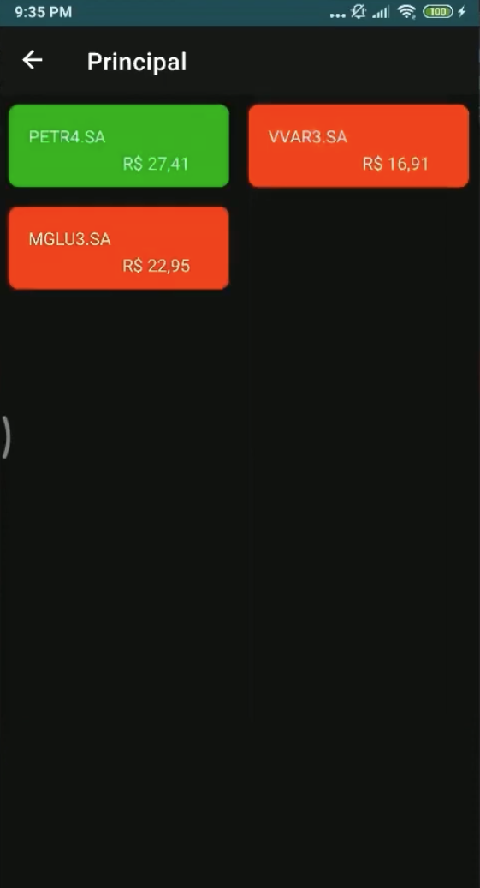
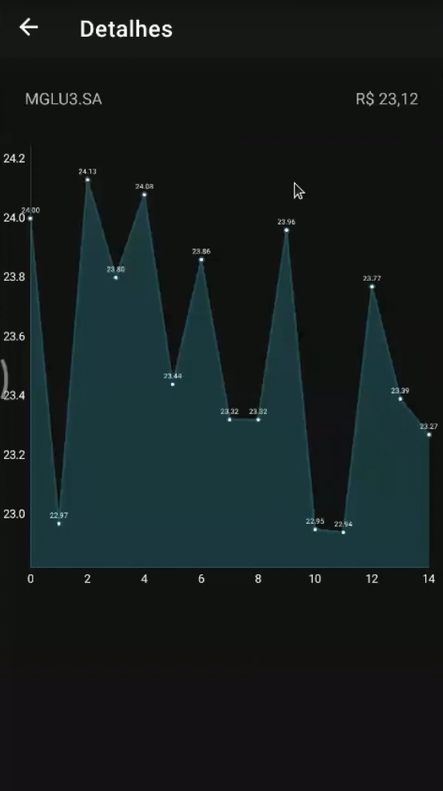

# Capital-Flow
Este repositório contém um projeto desenvolvido em Java com Spring Boot,  O projeto também inclui scripts SQL para manipulação de banco de dados e código Python para tarefas complementares. É ideal para aplicações web robustas e integrações com banco de dados.

# Atenção:
- Este projeto é um trabalho em andamento e está em fase de desenvolvimento. Algumas funcionalidades extras estão em desenvolvimento ou podem estar sujeitas a alterações. A próxima fase do projeto incluirá testes unitários e de integração para garantir a qualidade do código.
- Este projeto tem como objetivo o estudo e aprendizado, podendo conter linhas comentadas para auxiliar na compreensão e está em constante evolução.

## Descrição do Projeto
O **Capital-Flow** é um projeto desenvolvido em **Java** utilizando **Spring Boot 3+**, com foco em arquitetura de microsserviços e integração com sistemas distribuídos. Ele foi projetado para atender a requisitos modernos de desenvolvimento de software, como **Clean Code**, **REST APIs**, e práticas de **testes automatizados**. Além disso, o projeto utiliza **Python** para tarefas complementares e scripts SQL para manipulação de banco de dados.

## Tecnologias Utilizadas
- **Java** com **Spring Boot 3+**
- **Maven** como gerenciador de dependências.
- **Python** com **Flask**
- **Kafka** para mensageria assíncrona
- **PostgreSQL** para persistência de dados
- **Docker** e **Kubernetes** para deploy em ambientes de containers
- **SonarQube** para análise de qualidade de código

## Funcionalidades
- Integração com APIs externas para consulta de valores de ações (B3 e Yahoo Finance).
- Publicação de mensagens em tópicos Kafka para processamento assíncrono.
- Microsserviços com endpoints REST para gerenciamento de usuários e ações favoritas.
- Deploy automatizado em ambientes de containers utilizando **Kubernetes** e **GKE**.
- Suporte a bancos de dados relacionais e NoSQL.
- Arquitetura escalável e distribuída para processamento de grandes volumes de dados.

## Estrutura do Projeto
- **Backend**: Desenvolvido em **Java** com **Spring Boot**, seguindo os princípios de **Clean Code** e boas práticas de desenvolvimento.
- **Mensageria**: Utilização de **Kafka** para comunicação assíncrona entre microsserviços.
- **Banco de Dados**: Scripts SQL para **PostgreSQL** e **MySQL**, além de suporte a **MongoDB**.
- **Complementos**: Código em **Python** para tarefas específicas e integração com APIs externas.

## Final Model
<div style="display: flex; justify-content: space-between;">
  
  
</div>

## Requisitos para Configuração
1. **Clone o repositório**:
   ```bash
   git clone git@github.com:germannafol/Capital-Flow.git

2. **Configuração do ambiente**:
- Certifique-se de ter o Docker e o Kubernetes instalados.
- Configure as variáveis de ambiente para conexão com o banco de dados e APIs externas.

3. **Instalação de dependências**:
- Para o backend:
  ```bash
  mvn install
- Para o código Python:
  ```bash
  pip install -r requirements.txt

4. **Execução**:
- Inicie os containers:
  ```bash
  docker-compose up
- Execute os serviços:
  ```bash
  mvn spring-boot:run

**Práticas de Desenvolvimento**
- Testes Automatizados: O projeto está em fase de desenvolvimento e a próxima fase irá inclui testes unitários e de integração para garantir a qualidade do código.
- Code Review: Segue práticas de revisão de código para alinhamento técnico e melhoria contínua.
- Metodologias Ágeis: Utiliza SCRUM e KANBAN para organização de tarefas e refinamento técnico de histórias.

**Contribuição**
Contribuições são bem-vindas! Siga as diretrizes descritas no arquivo CONTRIBUTING.md.


**Contato**
Para dúvidas ou suporte, entre em contato pelo e-mail: germannafol@outlook.com